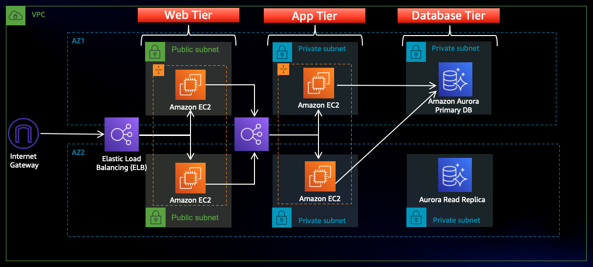

# 🚀 Secure & Scalable Three-Tier AWS Architecture on AWS

<p align="center">
  
</p>

<p align="center">


</p>

---

## 📖 Project Overview

This project demonstrates a production-style Three-Tier AWS Architecture designed following cloud security and high-availability best practices.

The infrastructure separates workloads into dedicated layers:

- 🌐 Web Tier (Public Subnets)
- ⚙️ Application Tier (Private Subnets)
- 🗄️ Database Tier (Private Subnets)

The architecture uses AWS networking, security, storage, database, and management services to build a scalable and secure environment.

---

# 🏗️ Architecture Diagram

<p align="center">
  
</p>

---

# 🎯 Architecture Highlights

✅ Multi-AZ Deployment

✅ Secure Network Segmentation

✅ No SSH Access

✅ IAM Role-Based Authentication

✅ Private Database Layer

✅ Highly Available Design

✅ S3 Integrated Application Deployment

✅ AWS Systems Manager Session Manager Access

---

# 🌐 Network Design

## VPC

| Component | CIDR |
|-----------|--------|
| VPC | 10.0.0.0/16 |

---

## Public Subnets (Web Tier)

| Subnet | CIDR |
|----------|----------|
| Public Web Subnet AZ-1 | 10.0.0.0/24 |
| Public Web Subnet AZ-2 | 10.0.10.0/24 |

---

## Private App Subnets

| Subnet | CIDR |
|----------|----------|
| Private App Subnet AZ-1 | 10.0.20.0/24 |
| Private App Subnet AZ-2 | 10.0.30.0/24 |

---

## Private Database Subnets

| Subnet | CIDR |
|----------|----------|
| Private DB Subnet AZ-1 | 10.0.40.0/24 |
| Private DB Subnet AZ-2 | 10.0.50.0/24 |

---

# ☁️ AWS Services Used

| Service | Purpose |
|----------|----------|
| Amazon VPC | Network Isolation |
| EC2 | Web & Application Servers |
| Application Load Balancer | Traffic Distribution |
| Auto Scaling Group | Automatic Scaling |
| Amazon Aurora MySQL | Database Layer |
| Amazon S3 | Application Storage |
| IAM | Secure Access Management |
| Systems Manager (SSM) | Secure Instance Access |

---

# 🔐 Security Implementation

### IAM Roles

Attached Policies:

- AmazonS3ReadOnlyAccess
- AmazonSSMManagedInstanceCore

### Security Best Practices

- No SSH Access
- No Public IP on App Tier
- No Public IP on Database Tier
- IAM-Based Authentication
- Private Subnet Isolation
- SSM Session Manager Access

---

# 📦 Application Deployment Flow

```text
Developer
    │
    ▼
 Amazon S3
    │
    ▼
 Web Tier EC2
    │
    ▼
 App Tier EC2
    │
    ▼
 Aurora Database
```
🌍 Web Tier Configuration

# Install Nginx
```
sudo yum install nginx -y

sudo systemctl start nginx

sudo systemctl enable nginx
```
# Download Configuration from S3
```
aws s3 cp s3://3tierprojects/nginx.conf .
```
⚙️ Application Tier Configuration
# Install Node.js using NVM
```
nvm install 16

nvm use 16
```
# Install PM2
```
npm install -g pm2
```

# Deploy Application
```
aws s3 cp s3://BUCKET_NAME/app-tier/ app-tier --recursive

cd app-tier
npm install

pm2 start index.js
pm2 save
```
🗄️ Aurora Database Configuration
# Connect to Aurora
```
mysql -h <endpoint> -u admin -p
```
# Create Database
```
CREATE DATABASE webappdb;
```
# Create Transactions Table
```
CREATE TABLE transactions(
id INT AUTO_INCREMENT PRIMARY KEY,
amount DECIMAL(10,2),
description VARCHAR(100)
);
```
# Insert Sample Data
```
INSERT INTO transactions(amount,description)
VALUES ('400','groceries');
```
# 📁 Repository Structure
```
aws-three-tier-web-application
│
├── README.md
│
├── architecture/
│   └── architecture-diagram.png
│
├── scripts/
│   ├── web-tier-setup.sh
│   ├── app-tier-setup.sh
│   └── db-setup.sql
│
├── docs/
│   ├── vpc-details.md
│   ├── subnet-details.md
│   └── iam-s3-setup.md
│
└── screenshots/
```
# 📸 Use service in a Project
```
VPC Setup
Subnet Configuration
Security Groups
EC2 Instances
Load Balancer
Aurora Database
```
# 🚀 Key Learnings
 - Designing Multi-Tier Architectures
 - AWS Networking Fundamentals
 - High Availability Design
 - IAM Security Best Practices
 - Session Manager Administration
 - Aurora Database Deployment
 - S3-Based Application Deployment

# 👨‍💻 Author
Aaditya Pal

Cloud & DevOps Enthusiast

# Social Account:
GitHub: https://github.com/aadityapalsagwan

LinkedIn: https://linkedin.com/in/aadityapalsagwan 
